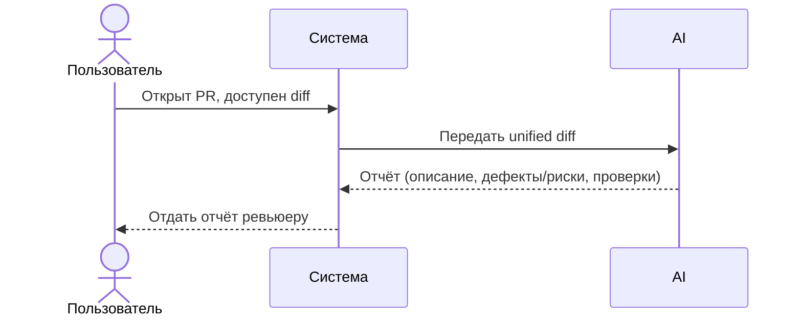

# Use cases и user stories

Файл ведёт OpenCode. Обсудите с агентом содержание и проверьте предложенный diff. Все дополнения и исправления поручайте агенту в чате.

## Первый рабочий сценарий

**Когда** открыт PR и ревьюеру доступен diff, **система** предоставляет ассистента, который по diff формирует краткое описание изменений, до трёх пунктов (доказанный дефект или потенциальный риск) с доказательствами/обоснованием и список предложенных проверок, **а пользователь получает** структурированный отчёт для быстрого анализа. Решение принимает человек.

Не входит в этот сценарий:

- approve/merge, изменение кода, использование внешних источников.

## Use case

| Поле | Значение |
|---|---|
| Актор | Ревьюер PR |
| Триггер | Открыт PR, доступен diff |
| Предусловия | Конфиг провайдера подключён; инструменты помощнику запрещены в тестовом запуске |
| Основной результат | Отчёт: описание, до 3 пунктов (дефект/риск), проверки |
| Ошибка или отказ | AS IS: отсутствие поля diff приводит к ошибке до формирования отчёта. TO BE: запрос отклоняется контролируемо до анализа; формат ответа и HTTP-статус остаются открытыми вопросами. Утверждения без достаточного evidence не включаются в «Риски», а преобразуются в предлагаемые проверки. |



## User stories и acceptance criteria

```gherkin
Feature: Помощник ревьюера PR по unified diff

  # Примечание: пункты ниже — TO BE (требования к ассистенту), а не утверждение о текущей реализации.
  # Требования к структуре итогового отчёта:
  # - Полный отчёт включает разделы: "Описание", "Риски" и "Проверки".
  # - Раздел "Риски" содержит не более трёх пунктов.
  # - Каждая выявленная проблема в разделе "Риски" должна иметь evidence:
  #   путь к файлу и координаты хунка unified diff (заголовок @@ -x,y +u,v @@) или точный фрагмент хунка.
  # - Координаты хунка не выдаём за номера строк исходного файла.
  # - Утверждения без достаточного evidence не включаем в раздел "Риски"; для них добавляем предлагаемую проверку в раздел "Проверки".

  Scenario: Позитивный — корректный unified diff → структурированный отчёт
    # TO BE: минимальные признаки корректного unified diff — заголовки файлов и хотя бы один хунк изменений
    Given на вход передан unified diff с заголовками файлов и хотя бы одним хунком изменений
    When помощник анализирует diff
    Then полный отчёт содержит разделы: "Описание", "Риски" (не более 3 пунктов) и "Проверки"
      And каждый пункт раздела "Риски" содержит evidence: путь к файлу и координаты из заголовка хунка @@ -x,y +u,v @@ или точный фрагмент хунка
      And координаты хунка не выдаются за номера строк исходного файла

  Scenario: Негативный — отсутствует поле diff в payload
    # AS IS: обращение к payload["diff"] без поля приводит к ошибке до формирования отчёта (см. TRAINING_PR.diff, app/api.py)
    # TO BE: запрос должен отклоняться контролируемо до анализа; формат ответа и HTTP-статус — открытые вопросы
    Given входной объект не содержит поля "diff"
    When инициируется анализ
    Then отчёт не формируется; анализ прекращается до формирования отчёта
      And формат ответа и HTTP-статус остаются открытыми вопросами

  Scenario: Граничный — найдено > 3 кандидатов и часть утверждений без evidence
    Given на вход передан unified diff с хотя бы одним хунком изменений
      And по результатам анализа найдено более трёх кандидатов в риски
      And часть утверждений не имеет достаточного evidence в diff
    When помощник формирует итоговый отчёт
    Then раздел "Риски" формируется по правилу (TO BE):
      And сначала применить обязательный фильтр достаточного evidence: допускаются только кандидаты с «путь + точный изменённый фрагмент» или «путь + координаты хунка»; общая ссылка только на файл недостаточна и такие кандидаты преобразуются в предлагаемые проверки раздела "Проверки"
      And если после фильтра осталось не более трёх кандидатов — включить их все в раздел "Риски"
      And если после фильтра осталось больше трёх кандидатов — упорядочить их по силе evidence: «путь + точный изменённый фрагмент» выше «путь + координаты хунка»; при равной силе — по порядку появления в diff
      And взять первые три кандидата из упорядоченного списка
      And evidence для каждого пункта "Рисков" содержит путь к файлу и координаты хунка или точный фрагмент этого хунка
```

## Статус проверки требований

| Утверждение | Статус | Evidence |
|---|---|---|
| Отсутствие поля diff приводит к ошибке до формирования отчёта | Подтверждено реализацией AS IS | TRAINING_PR.diff → app/api.py, хунк @@ -1,8 +1,17 @@ (обращение payload["diff"]) |
| Контролируемая валидация отсутствующего diff | Требование TO BE; реализация не показана в предоставленном diff | product_management.md (негативный сценарий, TO BE); формат ответа и HTTP-статус — OPEN |
| Проверка формата unified diff | Требование TO BE; в предоставленном diff не показана | context.md → «Факты и правила», «Формат входа и результата»; TRAINING_PR.diff не показывает валидацию формата |
| Структура «Описание / Риски ≤ 3 / Проверки» | Исходное требование Практики 1 | context.md → «Формат входа и результата» |
| Формат evidence: путь и координаты/фрагмент хунка | Исходное требование Практики 1 | context.md → «Факты и правила»; координаты из заголовка @@ -x,y +u,v @@ |
| Утверждения без evidence не входят в «Риски» | Принятое решение TO BE в Practice 2 | context.md → «Факты и правила» требует маркировать неподтверждённое как неизвестное/вопрос; конкретное исключение из «Рисков» принято по результатам R.C.T.F. и Tree of Thoughts |
| Evidence-first отбор ≤ 3 «Рисков» | Принятое решение TO BE (Tree of Thoughts) | tree_of_thoughts/experiment.md; product_management.md (граничный сценарий); tests_e2e.md (граничный) |
| Максимальный размер diff и политика усечения | Открытый вопрос | context.md → «Что пока неизвестно» |

## Как использовали AI

- Для чего: описать сценарий, use case и критерии приёмки для учебного кейса.
- Тип промпта: структурированный запрос (Build-сессия).
- Строка в [`prompts.md`](prompts.md): P1-04.
- Что проверил студент и какие исправления поручил агенту: разграничение дефектов и рисков; отсутствие утверждений вне diff; человек принимает решение.
